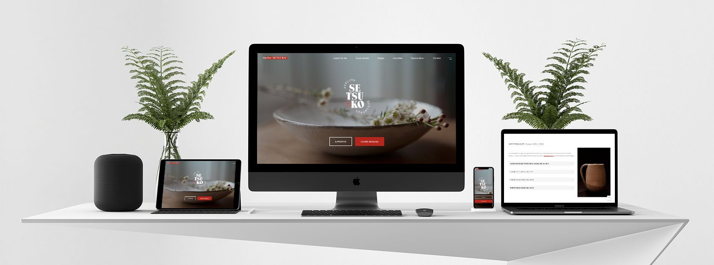

# 🌿 ATELIER SETSUKO 🌿 
## A BOOKING WEBSITE USING A CUSTOM CHILD THEME. 

The Atelier Setsuko is a place of learning, exchange and relaxation around ceramics located in the heart of Paris.

Enjoying a good reputation, its founder Stéphane found herself in 2021 overwhelmed by the management of the courses and the communication that she was doing until then by emails. She wanted me to redesign her existing website and install an automated appointment management system. The whole project was done by remote working. 

[>>> VISIT THE WEBSITE](https://www.ateliersetsuko.com)

&nbsp;

## KEYPOINTS
- ✅ Made with Wordpress and ❤️ .
- ✅ Content redaction and child theme customization (HTML, CSS, Javascript). 
- ✅ Fully responsive (custom media queries).
- ✅ 18 PHP pages 
- ✅ Page transition animations. 
- ✅ Account management system, with restricted access to some pages. 
- ✅ Booking / management system controlled by a plugin, and customized for the client's needs. 
- ✅ Email designs made from scratch with Visual Studio Code.  

&nbsp;

### 🔖 The Landing Page 
________________________________________________________________
... the full description is coming soon! 

&nbsp;

## Librairies used 
- [GSAP](http://www.w3schools.com/jquery/jquery_ref_ajax.asp) - GSAP simplifies HTML document traversing, event handling, animating, and Ajax interactions for rapid web development.
- [FontAwesome](https://developers.google.com/chart/interactive/docs/quick_start) - For icons.
plugins.

## To-do
- Content caching for faster page loads 
- Online store and payment (if needed by the client in the future). 

 Made with ❤️ by [Nicolas HODEE](https://www.nicolashodee.com/) - All rights reserved. 

